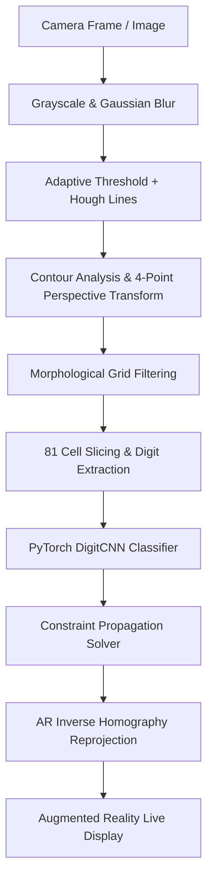

# 🧩 Real-Time Augmented Reality Sudoku Solver (PyTorch)

An end-to-end computer vision and deep learning system that detects Sudoku puzzles from live video streams or images, classifies the digits using a custom PyTorch Convolutional Neural Network (CNN), solves the board using constraint propagation, and projects the solved numbers seamlessly back onto the puzzle in augmented reality.

---

## ✨ Features

- **Real-Time AR Overlay**: Solved numbers are dynamically warped and reprojected onto the video frame using inverse homography transformations.
- **PyTorch Deep Learning Engine**: Custom LeNet-inspired `DigitCNN` with Batch Normalization and Dropout for robust handwritten and printed digit recognition.
- **Robust Computer Vision Pipeline**:
  - Adaptive Gaussian thresholding and Probabilistic Hough Line transforms for line isolation.
  - Quadrilateral contour detection and perspective correction (`four_point_transform`).
  - Morphological operations (rect-kernel erosion/dilation and XOR) to strip grid boundaries and isolate digit contours.
- **Constraint Satisfaction Solver**: Fast backtracking and constraint propagation engine capable of solving 9x9 grids in under 0.01 seconds.
- **Flexible CLI**: Supports live webcam streams, recorded videos, or static images with configurable inference device (`cpu` / `cuda`).
- **Interactive Controls**: Toggle demo mode, save high-resolution screenshots, and adjust real-time parameters on the fly.

---

## 🏗️ Architecture



---

## 📦 Project Structure

```
├── core/
│   ├── __init__.py
│   ├── detector.py          # OpenCV grid detection, perspective transform & cell slicing
│   ├── recognizer.py        # PyTorch digit inference with cell contour extraction
│   ├── solver.py            # Constraint propagation and search solver
│   └── visualizer.py        # Inverse perspective AR blending & HUD display
├── model/
│   ├── __init__.py
│   ├── network.py           # PyTorch DigitCNN architecture definition
│   └── train.py             # Training pipeline supporting MNIST and custom datasets
├── app.py                   # Main CLI application
├── sudoku_solver.py         # Backward-compatible entrypoint
├── requirements.txt         # Project dependencies
├── LICENSE                  # Apache 2.0 License
└── README.md                # Documentation
```

---

## 🚀 Quickstart

### 1. Prerequisites & Installation

Clone the repository and install the required dependencies:

```bash
git clone https://github.com/rajat2515/sudoku-solver.git
cd sudoku-solver

python3 -m venv .venv
source .venv/bin/activate  # On Windows: .venv\Scripts\activate
pip install -r requirements.txt
```

### 2. Train the Digit Recognizer (PyTorch)

You can train the PyTorch `DigitCNN` on the standard MNIST dataset with a single command (datasets are auto-downloaded):

```bash
python model/train.py --dataset mnist --epochs 15 --batch-size 64
```

To train on your own custom dataset (folder organized by digit subfolders `0/`, `1/`, ..., `9/`):

```bash
python model/train.py --dataset custom --data-dir ./data --epochs 25
```

The best model checkpoint is automatically saved to `model/digit_cnn.pt`.

---

## 🎮 Running the Solver

### Live Webcam Feed:
```bash
python app.py --source 0 --model model/digit_cnn.pt
```

### Static Image or Recorded Video:
```bash
python app.py --source sudoku_rt.png --model model/digit_cnn.pt
```

### Interactive Keyboard Controls:
| Key | Action |
|:---:|:---|
| `ESC` or `Q` | Exit application |
| `S` | Save current frame screenshot to `sudoku_screenshot.png` |
| `D` | Toggle sample puzzle demonstration mode |

---

## ⚙️ Command-Line Arguments

| Argument | Type | Default | Description |
|---|---|---|---|
| `--source` | `str` | `0` | Camera device index (e.g. `0`) or file path (`image.png` / `video.mp4`) |
| `--model` | `str` | `model/digit_cnn.pt` | Path to PyTorch model weights |
| `--device` | `str` | `cpu` | Device for inference: `cpu` or `cuda` |
| `--demo` | `flag` | `False` | Run with built-in reference puzzle |
| `--width` | `int` | `1000` | Target frame resize width for processing |

---

## 📄 License & Attribution

This project is open-source software licensed under the [Apache License, Version 2.0](LICENSE).

- **Solving Algorithm**: Based on Peter Norvig's classic constraint satisfaction and backtracking algorithm ([norvig.com/sudoku.html](https://norvig.com/sudoku.html)).
- **Neural Network**: Inspired by LeNet-5 (LeCun et al.) modernized with Batch Normalization and Dropout layers in PyTorch.
